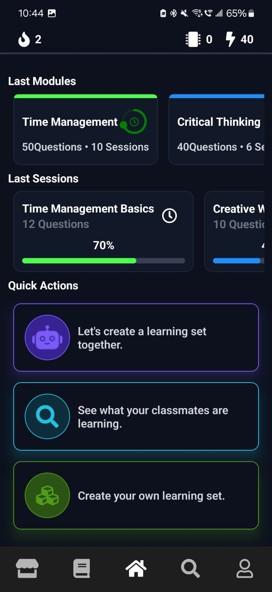
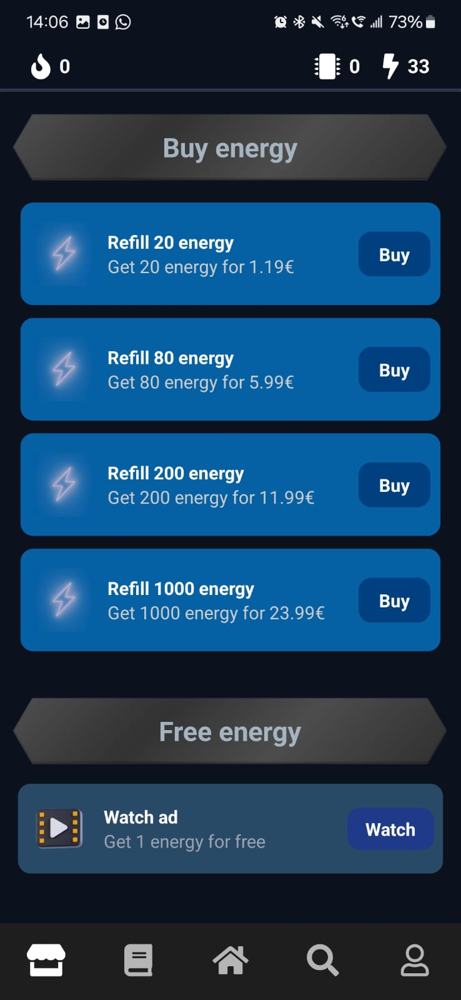
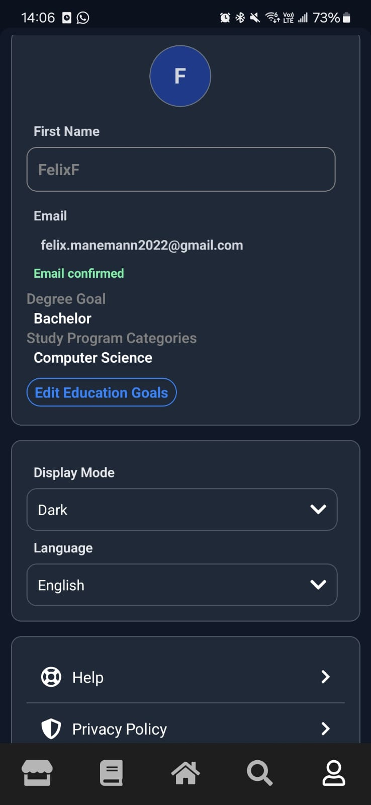
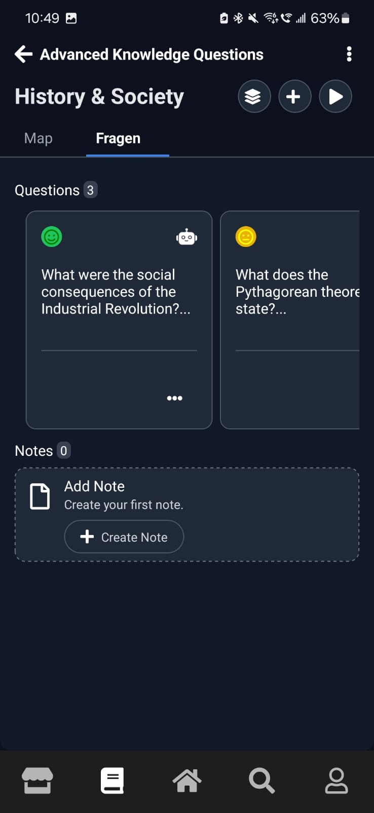
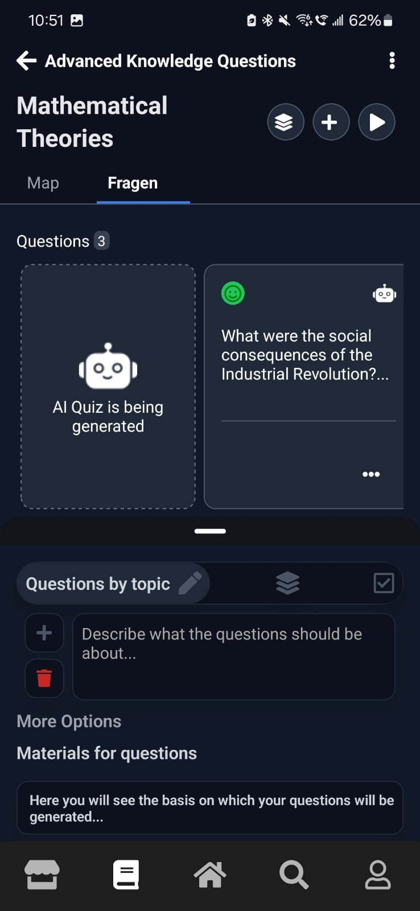
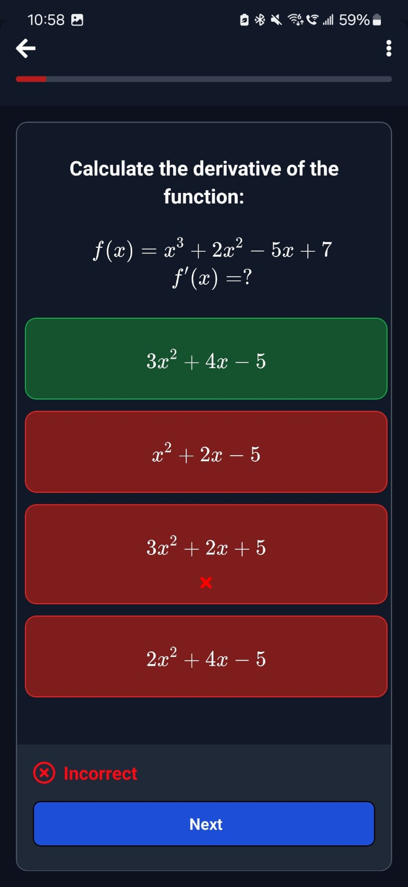
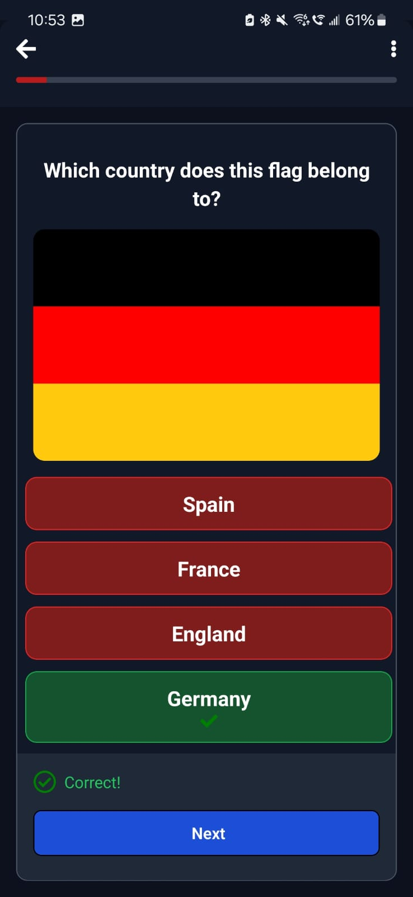
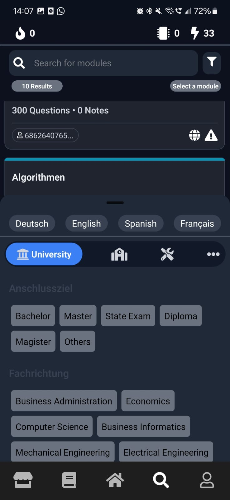
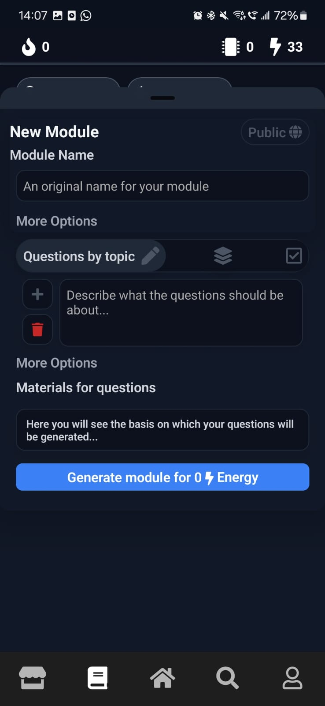

<!-- Highlighted App Store review notice -->

<strong>Notice:</strong> The app is currently under review by the App Store and is not yet available.

<!-- Title with icon -->

  
  <h1 style="margin:0;">QReady</h1>

# QReady

QReady is a learning platform designed for students, trainees, and university students. The app is currently available in English, German, Spanish, and French.

## About QReady

- Users can create modules, which contain sessions. Sessions can include quiz questions, documents, and notes.
- Documents can be published and shared via the "Discover" page.
- Modules can be created manually or with AI, based on texts, content, or existing questions. This feature works in all four supported languages.
- LaTeX formulas and images can be rendered in quiz questions.
- i18n is used for multilingual support.

### Technical Details

- Built with React Native.
- Backend: Appwrite and Python.
- AI Integration: OpenAI API (GPT-4).
- In-App Purchases: iOS and Google Play.
- Google AdMob integration.
- Search engine with filters for published modules.

<!-- Highlighted legal notice -->

<strong>All rights reserved by QReady.</strong> The code may be used for understanding specific aspects (e.g., Appwrite OAuth, OpenAI integration, IAP integration, Google AdMob integration) for learning purposes. Feedback and suggestions for improvement are very welcome! 🤗

## Screenshots

### General UI

  
  
  

**Descriptions:**
1. Home Screen  
2. Discover Page with User-Generated Modules  
3. Shop  
4. Profile

### Module Features

  
  
  #
    #

**Descriptions:**
4. Module Overview with Questions, etc.  
5. Module Overview with AI Generation  
6. Question with Latex 
7. Question with Image

### User & Creation

  
  

**Descriptions:**
7. Discover Modules 
8. Module Creation (AI)  

